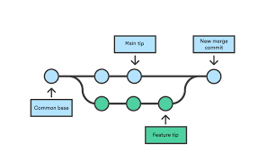

# this is my first group exercise
## *git commands*

```git branches
git branch
git switch
git checkout
git commit
git merge
git push
git pull
git add
```

Git branches \
Another image of branches .png)

Link to branches [Git commands](https://www.google.com/search?sca_esv=0ee0280be053867a&sca_upv=1&q=git+branches&uds=ADvngMhpsojwKe5eIOqT5IDaiLbe8EVMuYw_to5mqNv7ZQIimuRtSkYUbHz-1Lh0BwjRFywNsIrzexUS77isO11UQ0-TrUCCu8ofYzVZANwUBjY8ia1xZDmN9stJNZGtqPvKphwom1atGwKyW3lC8j2MvllJrOKyIYRs1nP4KyPmBbVwGL4tmxJT3NW205V0DGvuxj314vpRb41choBQStFh1pA6cYfe5tqR-Y6B_g9w8VGGVJ5ansMu6i4uebLspU9gWDykM1mfzAuLsPX_TFqxbqcnMS3B4A&udm=2&prmd=ivnbz&sa=X&sqi=2&ved=2ahUKEwjExOOg2pSGAxWUgP0HHaWeDbgQtKgLegQIDxAB&biw=1048&bih=929&dpr=1)