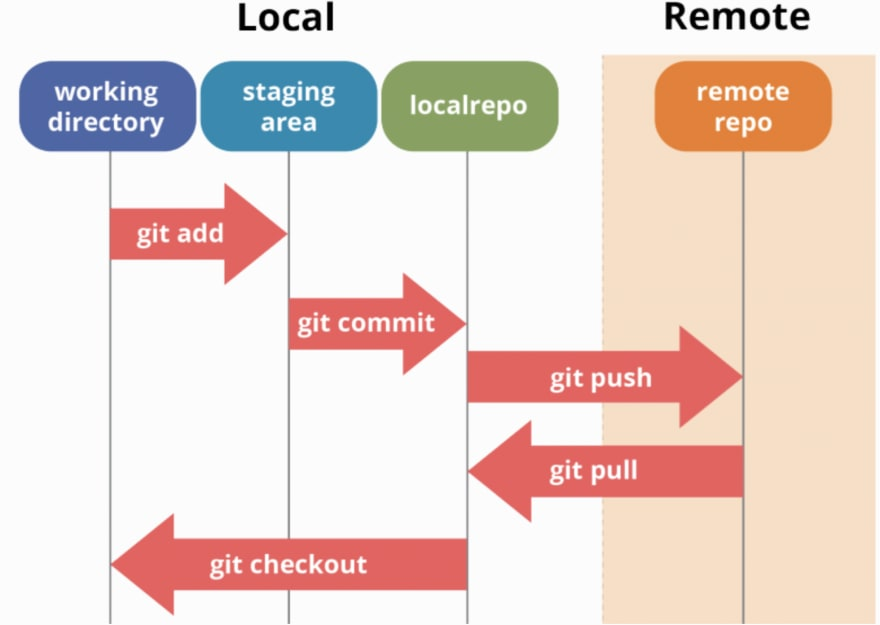

# Git workflows
## Introdution
GitHub flow is a lightweight, branch-based workflow.

## To begin
To follow GitHub flow, you will need a GitHub account and a repository.

## Following GitHub flow
You can complete all steps of GitHub flow through:
- the GitHub web interface 
- command line
- GitHub CLI
- GitHub Desktop.

This is a hyperlink to markdown [Github workflows] (https://docs.github.com/en/get-started/getting-started-with-git/git-workflows)

## Workflow & Commonly Used Commands
Let's review a simple project workflow and the CLI commands that help us move from one step to the next. Below is a diagram of a workflow including Git & Github. This diagram most closely represents the flow of my group project.

### git clone

The very first step (not included on diagram) is to clone the repository to your local machine. Be sure to clone the project in a working directory that makes sense so you can easily remember where your local project lives.

### git pull origin master

Next, pull down from the remote repository (reminder, this lives on GitHub) to make sure you have up to date information. Believe it or not, changes could have been made by a team member in the time it took you to clone down the repository to your computer.

### git checkout -b new_branch_name

Create your own branch! If you’re working in a group project like I was, you will probably want to create a new branch for the feature you are working on. Make sure you are titling your branch according to the standards of your workplace expectations. You now have your own little place to experiment with code without immediately affecting changes on the master branch!

** note: you might not need to create a new branch if you are intentionally editing an existing branch. In that case, be sure you are on the correct branch and not the master prior to making any changes. Always check with your teammates before creating/editing branches.

### git add file_name

After your code has been tested and is complete, add your changes to the staging area.

### git status

Run git status to confirm that your files have been added

### Git commit

git commit -m "valuable_but_short_message_here"

Commit your changes back to the repository.

### git push

git push branch_name

This is an image \